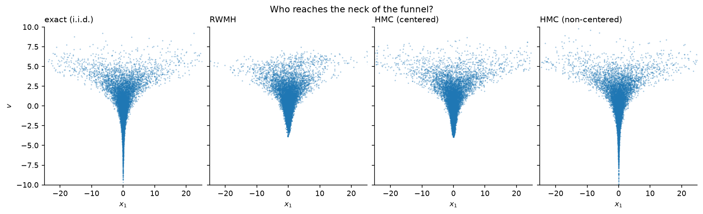
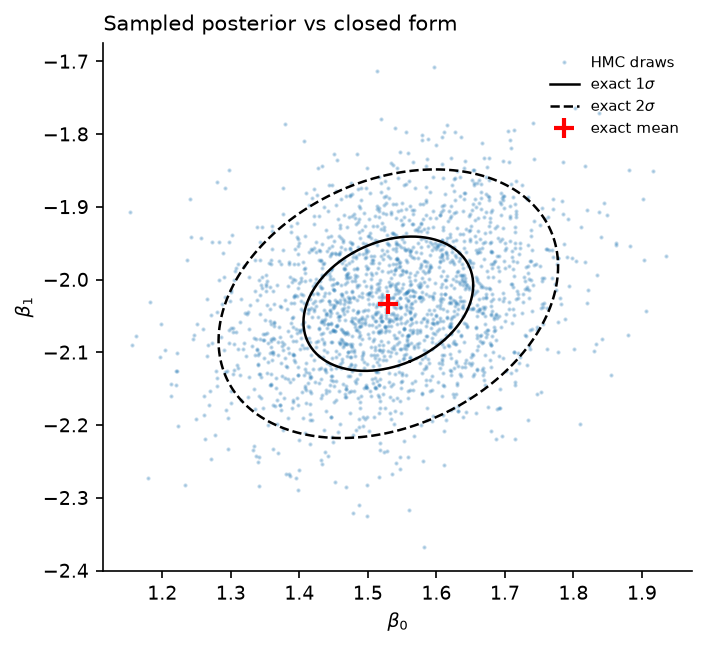
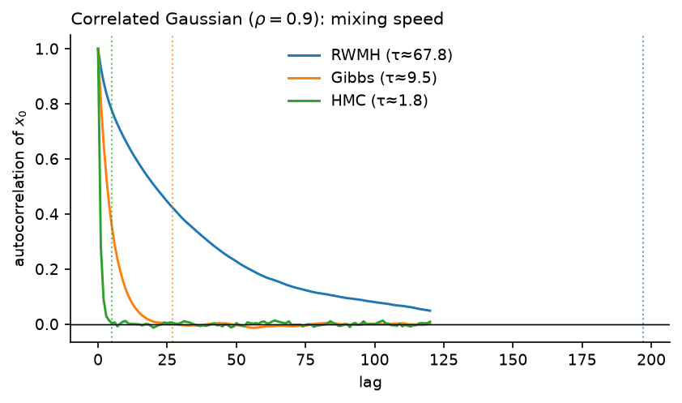
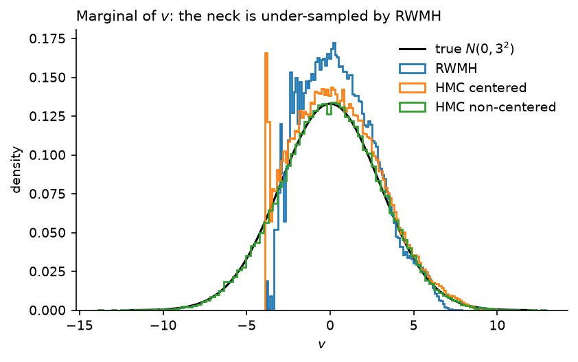
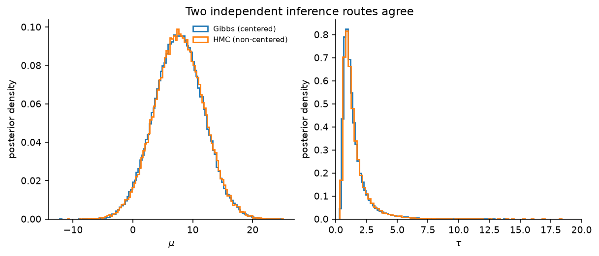
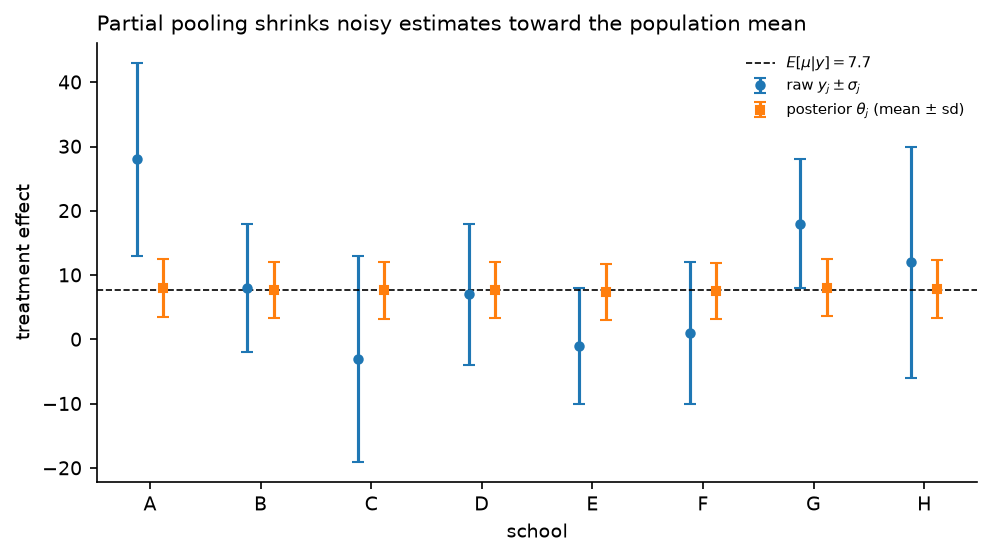
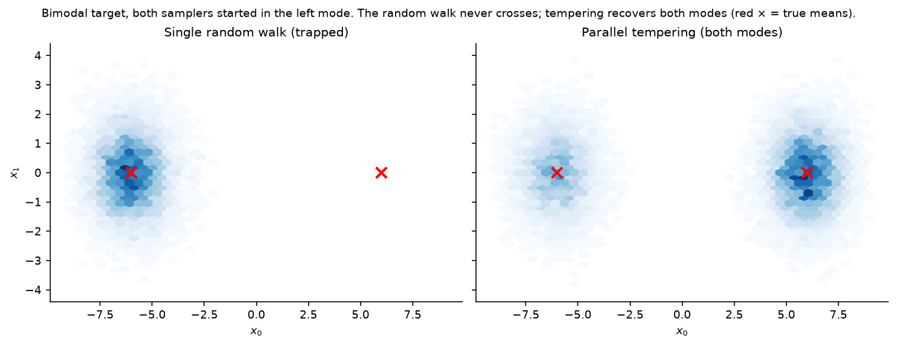
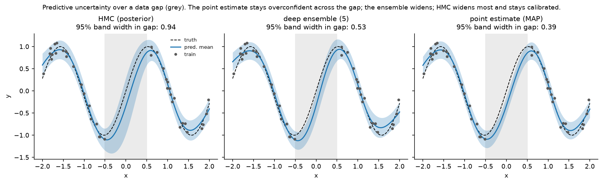
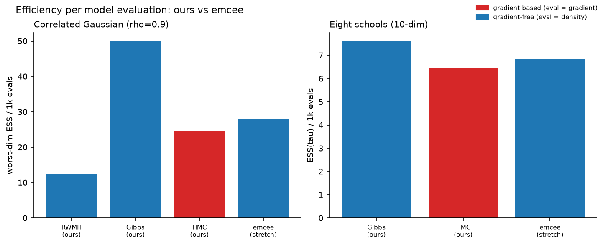

# MCMC from scratch


Metropolis–Hastings, Gibbs, and Hamiltonian Monte Carlo implemented in pure
NumPy — no PyMC, no Stan, no autograd — and **validated against exact
answers** at every level: hand-derived gradients against finite differences,
sampler moments against closed-form posteriors, the ESS estimator against the
AR(1) closed form, and (where no closed form exists) two independent
inference routes against each other.



*Neal's funnel, 10D. True marginal: $v \sim N(0, 3^2)$. A random walk never
reaches the neck (sd$[v]$ = 2.22), gradient-guided HMC gets closer but
diverges in the neck (sd = 2.60, 6% divergent), and reparameterizing the
geometry solves the problem outright (sd = 2.99, zero divergences). Fixing
the geometry beats tuning the sampler.*

## Problem

Bayesian inference needs expectations under a posterior known only up to a
constant: $\pi(\theta) \propto p(y \mid \theta)\,p(\theta)$. MCMC builds a
Markov chain with stationary distribution $\pi$ using only density *ratios*,
so the intractable normalizer cancels. This repo implements the three
classical kernels, the diagnostics needed to trust them, and experiments
designed so that **every claim has a ground truth or a cross-check**.

Full derivations (detailed balance → MH → Gibbs-as-MH → the HMC involution
argument → dual averaging → ESS/R-hat) are in
[`theory/derivations.md`](theory/derivations.md). The short version of why
HMC works:

$$\pi(x, p) \propto e^{-H(x,p)}, \quad H = -\log\tilde\pi(x) + \tfrac12\lVert p\rVert^2$$

Hamiltonian flow conserves $H$, preserves phase-space volume (Liouville), and
is reversible — an exact-flow proposal would always be accepted. The leapfrog
integrator keeps volume preservation and reversibility *exactly* (each
substep is a unit-Jacobian shear; the composition is palindromic) and loses
only energy conservation to $O(\varepsilon^2)$, which a Metropolis step with
$\alpha = \min(1, e^{-\Delta H})$ repairs. Both structural properties are
pinned by tests: reversibility to $10^{-10}$, and a measured ~4× drop in peak
$|\Delta H|$ when $\varepsilon$ is halved at fixed trajectory time.

## What's implemented

| Module | Contents |
|---|---|
| [`mcmc/metropolis.py`](mcmc/metropolis.py) | Random-walk MH, log-space accept, batched chains |
| [`mcmc/gibbs.py`](mcmc/gibbs.py) | Systematic- **or** random-scan driver over state dicts + Gaussian full conditionals derived via the precision matrix. At matched work, systematic scan is ~2× more efficient than random scan on the correlated Gaussian ([`experiments/gibbs_scan.py`](experiments/gibbs_scan.py)) — random scan can leave a coordinate stale for a sweep |
| [`mcmc/hmc.py`](mcmc/hmc.py) | Leapfrog, HMC with jittered trajectory length, dual-averaging warmup (Hoffman & Gelman 2014, Alg. 5), divergence tracking |
| [`mcmc/mala.py`](mcmc/mala.py) | Metropolis-adjusted Langevin: one gradient-drift Euler step with the full asymmetric Hastings correction — RWMH plus a score-driven drift, and the exact bridge toward score-based diffusion (unadjusted annealed Langevin is this proposal minus the accept step) |
| [`mcmc/tempering.py`](mcmc/tempering.py) | Parallel tempering (replica exchange): geometric temperature ladder, even/odd swap moves, per-pair swap-rate diagnostics — for multimodal targets |
| [`mcmc/diagnostics.py`](mcmc/diagnostics.py) | FFT autocorrelation, $\tau_{\text{int}}$ via Geyer initial monotone sequence, bulk ESS, tail ESS (Vehtari et al. 2021 — min over the 5%/95% tail-indicator ESSs, so a poorly-explored tail is flagged even when the bulk mixes), split-$\hat R$, compute-normalized efficiency (ESS per second / per evaluation), and `thinning_variance_ratio` — the closed-form price of thinning an AR(1) chain, $R = k(1+\rho^k)(1-\rho)/[(1-\rho^k)(1+\rho)] \ge 1$, proved and measured in [theory](theory/derivations.md) §6.3 (thinning never improves accuracy; it costs most when the chain mixes *well*) |
| [`mcmc/targets.py`](mcmc/targets.py) | Correlated Gaussians, Neal's funnel, Rosenbrock, Student-t, Gaussian mixtures — with analytic gradients and exact reference samplers |
| [`mcmc/models.py`](mcmc/models.py) | Conjugate Bayesian linear regression (closed-form posterior as answer key); eight schools with conjugate Gibbs conditionals *and* a non-centered HMC parameterization with hand-derived, Jacobian-corrected gradients |
| [`mcmc/bnn.py`](mcmc/bnn.py) | Bayesian neural network (1-hidden-layer tanh MLP) with hand-written backprop log-posterior gradient, sampled by HMC; plus an Adam MAP/deep-ensemble trainer sharing the same model and objective |

All log-densities are batched over chains, so 4 chains advance in lockstep as
one NumPy computation. Everything is seeded and reproducible.

## Results

### 1. Exact-posterior validation (`experiments/validate_exact.py`)

Correlated Gaussian ($\rho = 0.9$), 4 chains, overdispersed starts:

| sampler | draws | accept | max mean err | rel cov err | $\tau(x_0)$ | ESS$(x_0)$ | ESS/1k evals | $\hat R$ |
|---|---|---|---|---|---|---|---|---|
| RWMH | 160k | 0.50 | 0.027 | 0.002 | 67.8 | 2 358 | 14.7 | 1.000 |
| Gibbs | 160k | 1.00 | 0.009 | 0.003 | 9.5 | 16 778 | 52.4 | 1.000 |
| HMC | 40k | 0.82 | 0.018 | 0.013 | **1.8** | **21 760** | 26.0 | 1.000 |

All three reproduce the exact moments. The efficiency story has a nuance
worth stating precisely: **per draw**, HMC dominates ($\tau$ 37× smaller than
RWMH); **per density evaluation**, exact-conditional Gibbs wins on this
target — when conjugacy hands you the full conditionals, use them. On the
conjugate linear-regression posterior (samplers see only the unnormalized
density), sampled means match the closed form to $\le 0.003$:

<p align="center"></p>

<p align="center"></p>

### 2. Neal's funnel (`experiments/funnel.py`)

True $v$-marginal is $N(0, 3^2)$ exactly — so bias is measurable:

| sampler | draws | E$[v]$ (true 0) | sd$[v]$ (true 3) | $\tau(v)$ | ESS$(v)$ | $\hat R(v)$ | divergent |
|---|---|---|---|---|---|---|---|
| RWMH | 400k | 0.53 | 2.22 | 2361 | 169 | 1.04 | — |
| HMC (centered) | 100k | 0.49 | 2.60 | 190 | 528 | 1.02 | 5 998 |
| HMC (non-centered) | 100k | **0.02** | **2.99** | 12.5 | 8 001 | 1.000 | 0 |

Two honest lessons the numbers force on you: (1) $\hat R = 1.04$ while
missing the neck entirely — $\hat R \approx 1$ is *necessary, not
sufficient*; only the exact marginal exposes the bias. (2) The centered HMC
divergences aren't noise to suppress; they're the sampler reporting the
region it cannot enter. The non-centered change of variables
$x_i = e^{v/2} z_i$ makes the target an independent Gaussian (the Jacobian
cancels the varying scale exactly — derivation in Sec. 4.6), and every
pathology disappears.

<p align="center"></p>

### 3. Real data: eight schools (`experiments/eight_schools.py`)

Rubin's (1981) SAT coaching study under the hierarchical model
$y_j \sim N(\theta_j, \sigma_j^2)$, $\theta_j \sim N(\mu, \tau^2)$,
$p(\mu) \propto 1$, $\tau^2 \sim \text{InvGamma}(1, 1)$. No closed form
exists, so correctness rests on **two independent routes agreeing**:
conjugate Gibbs on the centered parameterization vs HMC on the non-centered
one (different parameterizations, different kernels, different code paths).

Result: all 10 posterior means agree to **0.131** (posterior sds are ~4.3,
so this is within Monte Carlo error), $\hat R \le 1.002$ everywhere. HMC's
ESS on $\mu$ is 63k from 80k draws vs Gibbs's 1.5k from 160k — the centered
Gibbs chain suffers exactly the $\mu$–$\theta$ coupling that non-centering
removes.

<p align="center"></p>
<p align="center"></p>

**Prior sensitivity, stated plainly:** the InvGamma(1,1) prior on $\tau^2$
was chosen to keep all Gibbs conditionals conjugate, and it concentrates
$\tau$ near ~1.5, i.e. strong pooling. The classic half-Cauchy analysis
(Gelman 2006) is far more diffuse in $\tau$. With $J = 8$ noisy groups the
data genuinely cannot pin $\tau$ down, so the prior matters — both routes
share the prior, which is what makes their agreement a valid check of the
*samplers* rather than a claim about the *science*.

### 4. Multimodal targets: parallel tempering (`experiments/tempering.py`)

Every sampler above assumes it can reach the whole distribution. On a
well-separated mixture that assumption breaks: the barrier between modes is
crossed with exponentially small probability, so a single chain reports
whichever mode it started in. Two Gaussians 12 units apart (weights
0.35 / 0.65), **both samplers started entirely in the left mode**:

| sampler | E$[x_0]$ (true 1.8) | left-mode frac (true 0.35) |
|---|---|---|
| single random walk | −6.0 | 1.00 (never crossed) |
| parallel tempering (8 replicas) | **1.82** | **0.35** |

Parallel tempering runs replicas at inverse temperatures $\beta_k$ from 1 down
to 0.01; the hot replicas roam freely across the flattened landscape and
adjacent-replica swaps ferry that mobility down to the cold ($\beta=1$) chain.
Swap acceptance holds at ~0.7 across the ladder, so the mode-hopping actually
reaches the bottom.

<p align="center"></p>

### 5. A real posterior: Bayesian neural network (`experiments/bnn.py`)

Every target above is a hand-written density. This one is a *model*: the
unknown is the full weight vector of a small tanh MLP (`mcmc/bnn.py`,
$3H+1 = 49$ dimensions at $H=16$), and the target is its Bayesian posterior —
Gaussian likelihood, isotropic Gaussian prior. The log-posterior gradient is a
backprop pass written out by hand and checked against finite differences, so
HMC is running on exactly the quantity training would compute. The data is
$\sin(3x)$ on $[-2, 2]$ **with a gap cut out of the middle**; the question is
which method reports that it is guessing across the gap.

Three predictive bands on the same model — HMC (samples the posterior), a
5-member deep ensemble (the same net from 5 random inits), and a single Adam
MAP point estimate:

<p align="center"></p>

Held-out calibration on 400 fresh points, split into the observed region and
the gap (95% target coverage):

| method | region | 95% coverage | mean NLL | mean pred. std |
|---|---|---|---|---|
| HMC (posterior) | observed | 0.94 | −0.67 | 0.11 |
| HMC (posterior) | **gap** | **1.00** | **0.08** | **0.24** |
| deep ensemble (5) | observed | 0.88 | −0.50 | 0.11 |
| deep ensemble (5) | **gap** | 0.57 | 0.84 | 0.14 |
| point estimate (MAP) | observed | 0.91 | −0.63 | 0.10 |
| point estimate (MAP) | **gap** | **0.30** | **2.47** | 0.10 |

The point estimate has no epistemic uncertainty — its band is a constant-width
noise ribbon, so it stays just as confident inside the gap (coverage collapses
to 0.30, NLL blows up to 2.47). The deep ensemble widens and is the strong
cheap baseline, but still under-covers the gap (0.57). HMC widens the most and
stays calibrated (1.00 / NLL 0.08).

**Convergence is judged in function space, on purpose.** The weight posterior
is invariant to permuting hidden units and to sign-flipping (tanh is odd), so
it is massively multimodal and split-$\hat R$ on a raw weight coordinate is
meaningless — measured here, median 1.55 and up to 2.58 across coordinates.
The *predictions* are a permutation-invariant functional of the weights, and
their split-$\hat R$ sits at 1.02 (max 1.08) with ESS in the hundreds. Always
diagnose the quantity you care about, not the raw parameters.

### 6. External benchmark: ours vs emcee (`experiments/external_benchmark.py`)

Every section above validates against an *exact answer*. This one validates
against another *sampler*: [emcee](https://emcee.readthedocs.io) (Foreman-Mackey
et al. 2013), the widely used affine-invariant ensemble sampler. emcee is
gradient-free and its stretch move is invariant under affine reparameterization
— which is the entire benchmark. It is run **vectorized** on our batched
`logpdf` (same NumPy-over-an-ensemble computation as ours, so the wall-clock gap
is algorithmic), ESS is computed with *our* estimator for every sampler, and
"evaluations" counts every call touching the whole model over the full run —
a density eval (RWMH/emcee), a full-conditional draw (Gibbs), or a gradient eval
(HMC), with emcee's counted exactly by wrapping its log-prob.

**Correlated Gaussian** ($\rho = 0.9$), worst-dimension ESS:

| sampler | grad? | draws | min ESS | ESS / 1k evals | $\hat R$ |
|---|---|---|---|---|---|
| RWMH (ours) | no | 160k | 2 112 | 12.6 | 1.001 |
| Gibbs (ours) | no | 160k | 16 778 | **49.9** | 1.000 |
| HMC (ours) | yes | 40k | **20 608** | 24.6 | 1.000 |
| emcee (stretch) | no | 256k | 8 050 | 27.9 | 1.003 |

Per evaluation, emcee's affine-invariant stretch beats the naive
coordinate-wise random walk with **zero tuning** (27.9 vs 12.6 — the
correlation an affine map removes costs it nothing) and even edges HMC's
per-eval number. But recall an HMC evaluation is a *gradient*, the rest are
*densities* (a gradient costs a constant factor more — the honest asterisk on
the per-eval column). On a target this cheap and low-dimensional, exact-
conditional Gibbs wins outright — both per evaluation and, at ~38k ESS/s,
per wall-clock second. No single method leads on every axis.

**Eight schools** (10-dim), ESS on $\mu$ and the hard funnel-neck coordinate $\tau$:

| sampler | grad? | ESS($\mu$) | ESS($\tau$) | ESS($\tau$) / 1k evals | $\hat R(\tau)$ |
|---|---|---|---|---|---|
| Gibbs (ours, centered) | no | 601 | 6 690 | **7.6** | 1.001 |
| HMC (ours, non-centered) | yes | **30 274** | 5 872 | 6.4 | 1.001 |
| emcee (stretch, non-centered) | no | 6 845 | 6 035 | 6.9 | 1.004 |

HMC is the only sampler uniformly efficient across all ten coordinates —
gradient plus non-centering give ESS($\mu$) ~30k — but that took a hand-derived,
Jacobian-corrected gradient *and* the reparameterization, and it still logged
~1% divergences in the neck. **emcee's real case is here:** with no gradient and
no reparameterization, it reaches ESS comparable to HMC on the hard $\tau$
coordinate and balanced ESS elsewhere, for the price of writing down the
log-density alone. Centered Gibbs is fastest per second but its $\mu$–$\theta$
coupling wrecks ESS($\mu$) (~600) — the same coupling non-centering removes.

<p align="center"></p>

The honest summary: **use the gradient when you have it and the dimension isn't
tiny** (HMC's uniform, high per-coordinate ESS), **use conjugacy when you have
it** (Gibbs's cheap exact conditionals), and **reach for a gradient-free
ensemble like emcee when deriving a gradient is impractical** — it is
genuinely competitive per evaluation and needs nothing but the log-density.

## Reproduce

```bash
python -m venv .venv && source .venv/bin/activate
pip install -r requirements.txt && pip install -e .
pytest                          # 58 tests; RuntimeWarnings are errors
cd experiments
python validate_exact.py        # ~30 s
python funnel.py                # ~2 min
python eight_schools.py         # ~1 min
python tempering.py             # ~20 s  (bimodal: tempering vs a trapped chain)
python bnn.py                   # ~1 min  (Bayesian NN: HMC vs ensemble vs MAP)
python external_benchmark.py    # ~10 s  (ours vs emcee; needs `pip install emcee`)
```

`emcee` is used *only* by the external benchmark — it is not a dependency of the
package or the tests (CI installs numpy + pytest only). Install it with
`pip install emcee` or `pip install -e '.[bench]'`.

Figures land in `figures/`; every table above is printed by the scripts.
Seeds are fixed (`SEED = 20260703`).

## Design notes

- **Tests assert theory, not just plumbing.** Leapfrog reversibility at
  $10^{-10}$; $O(\varepsilon^2)$ energy scaling; Gibbs's lag-1
  autocorrelation equal to $\rho^2$ on a bivariate Gaussian; the ESS
  estimator recovering $\tau = (1+\rho)/(1-\rho)$ on AR(1) data; every
  hand-derived gradient against central differences.
- **Divergences are a feature.** Trajectories that leave the typical set
  overflow to `inf`/`NaN`, which propagates to a $-\infty$ acceptance ratio
  and a rejection — the mechanism *is* the diagnostic. `np.errstate` is
  scoped to exactly those computations, and the test suite turns any other
  `RuntimeWarning` into a failure.
- **Adaptation stops at warmup's end.** Tuning $\varepsilon$ from chain
  history during sampling would break invariance; dual averaging freezes at
  the averaged iterate.
- **Samplers never see closed forms.** Models expose only
  $\log\tilde\pi$ / $\nabla\log\tilde\pi$; exact posteriors live in separate
  methods used purely for validation.

## Limitations / next

- Unit mass matrix; estimating $M$ from warmup covariance would fix the
  Gaussian experiment's scale mismatch more elegantly than step-size tuning.
- Fixed trajectory length (jittered): the principled endpoint is NUTS's
  U-turn criterion.
- Split-$\hat R$ without rank-normalization (Vehtari et al. 2021 is the
  modern refinement).
- **Phase 2 (done):** Bayesian neural network posterior via this repo's HMC on
  a small MLP — predictive uncertainty and calibration vs a MAP point estimate
  and a deep ensemble ([`experiments/bnn.py`](experiments/bnn.py), section 5).
  Next on this thread: a diagonal mass matrix so HMC does not need such a small
  step size on the ~49-dim weight posterior.

## References

Key sources: Neal (2011) *MCMC using Hamiltonian dynamics*; Hoffman & Gelman
(2014) JMLR (dual averaging); Geyer (1992) *Statist. Sci.* (initial sequence
estimators); Gelman & Rubin (1992); Roberts, Gelman & Gilks (1997) (0.234);
Neal (2003) (funnel); Rubin (1981) (data); Betancourt (2017) arXiv:1701.02434;
Foreman-Mackey et al. (2013) PASP (emcee, the external-benchmark baseline).
Full list with roles in [`theory/derivations.md`](theory/derivations.md).

## Provenance

Built as a study resource: implemented from scratch with AI assistance
(Claude), with every derivation written out in
[`theory/derivations.md`](theory/derivations.md) and every non-obvious claim
tested. MIT license.

*Suggested GitHub topics:* `mcmc` `hamiltonian-monte-carlo` `gibbs-sampling`
`metropolis-hastings` `bayesian-inference` `numpy` `from-scratch`
