# MCMC from scratch


Metropolis–Hastings, Gibbs, and Hamiltonian Monte Carlo implemented in pure
NumPy — no PyMC, no Stan, no autograd — and **validated against exact
answers** at every level: hand-derived gradients against finite differences,
sampler moments against closed-form posteriors, the ESS estimator against the
AR(1) closed form, and (where no closed form exists) two independent
inference routes against each other.

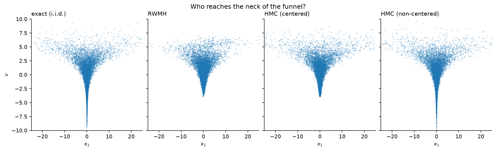

*Neal's funnel, 10D. True marginal: $v \sim N(0, 3^2)$. A random walk never
reaches the neck (sd$[v]$ = 2.22), gradient-guided HMC gets closer but
diverges in the neck (sd = 2.60, 6% divergent), and reparameterizing the
geometry solves the problem outright (sd = 2.99, zero divergences). Fixing
the geometry beats tuning the sampler.*

## Problem

Bayesian inference needs expectations under a posterior known only up to a
constant: $\pi(\theta) \propto p(y \mid \theta)\,p(\theta)$. MCMC builds a
Markov chain with stationary distribution $\pi$ using only density *ratios*,
so the intractable normalizer cancels. This repo implements the three
classical kernels, the diagnostics needed to trust them, and experiments
designed so that **every claim has a ground truth or a cross-check**.

Full derivations (detailed balance → MH → Gibbs-as-MH → the HMC involution
argument → dual averaging → ESS/R-hat) are in
[`theory/derivations.md`](theory/derivations.md), which ends with
[five exercises](theory/derivations.md#7-exercises) over the material —
MALA's Hastings correction and the bias it repairs, a Gibbs sampler for
regression with unknown noise, the $\rho^2$ autocorrelation, leapfrog under a
mass matrix, and the replica-exchange acceptance ratio — with collapsed
solutions and, for each, the test or experiment that checks the answer. The
short version of why HMC works:

$$\pi(x, p) \propto e^{-H(x,p)}, \quad H = -\log\tilde\pi(x) + \tfrac12\lVert p\rVert^2$$

Hamiltonian flow conserves $H$, preserves phase-space volume (Liouville), and
is reversible — an exact-flow proposal would always be accepted. The leapfrog
integrator keeps volume preservation and reversibility *exactly* (each
substep is a unit-Jacobian shear; the composition is palindromic) and loses
only energy conservation to $O(\varepsilon^2)$, which a Metropolis step with
$\alpha = \min(1, e^{-\Delta H})$ repairs. Both structural properties are
pinned by tests: reversibility to $10^{-10}$, and a measured ~4× drop in peak
$|\Delta H|$ when $\varepsilon$ is halved at fixed trajectory time.

## What's implemented

| Module | Contents |
|---|---|
| [`mcmc/metropolis.py`](mcmc/metropolis.py) | Random-walk MH, log-space accept, batched chains |
| [`mcmc/gibbs.py`](mcmc/gibbs.py) | Systematic- **or** random-scan driver over state dicts + Gaussian full conditionals derived via the precision matrix. At matched work, systematic scan is ~2× more efficient than random scan on the correlated Gaussian ([`experiments/gibbs_scan.py`](experiments/gibbs_scan.py)) — random scan can leave a coordinate stale for a sweep |
| [`mcmc/hmc.py`](mcmc/hmc.py) | Leapfrog, HMC with jittered trajectory length, dual-averaging warmup (Hoffman & Gelman 2014, Alg. 5), optional **diagonal mass-matrix adaptation** from windowed warmup variances (Stan-style memoryless windows — a per-axis preconditioner so one step size fits an axis-aligned target of unequal scales), divergence tracking |
| [`mcmc/nuts.py`](mcmc/nuts.py) | No-U-Turn Sampler (multinomial, Betancourt 2017): recursive doubling with the generalized U-turn criterion, canonical (multinomial) state selection, gradient-cached leapfrog (one gradient per leaf), max-depth **and** per-iteration divergence handling, same dual-averaging warmup — HMC with the trajectory-length knob removed. ~4–6× the ESS per gradient of hand-tuned fixed-$L$ HMC (§9) |
| [`mcmc/mala.py`](mcmc/mala.py) | Metropolis-adjusted Langevin: one gradient-drift Euler step with the full asymmetric Hastings correction — RWMH plus a score-driven drift, and the exact bridge toward score-based diffusion (unadjusted annealed Langevin is this proposal minus the accept step) |
| [`mcmc/sgld.py`](mcmc/sgld.py) | Stochastic gradient Langevin dynamics (Welling & Teh 2011): MALA with the accept step deleted and the gradient replaced by a minibatch estimate. Unadjusted, so it does **not** target $\pi$ — the point of the module is measuring how far off it is. On a Gaussian the stationary law is exactly $N(0,\ s^2/(1 - \epsilon^2/4s^2))$, a closed form the tests check at over-dispersions from 0.25% to 96%. The minibatch noise is negligible only below $\epsilon = 2/\sqrt{\mathrm{Var}[\hat g]}$, measured at $\approx 0.0045$ on the BNN posterior with batch 20 of 200 — *smaller* than a step one would actually run there |
| [`mcmc/sghmc.py`](mcmc/sghmc.py) | **Stochastic gradient HMC** (Chen, Fox & Guestrin 2014): momentum, friction, and the noise correction that makes the two consistent. Without friction the chain has no stationary law at all — symplectic Euler preserves volume, so a noisy gradient pumps energy in forever. The stationary covariance on a Gaussian is the exact solution of a discrete Lyapunov equation, which separates the errors by order: $O(h^2)$ from the discretization, $O(h)/\gamma$ from an uncorrected minibatch noise. At matched bias and matched gradient evaluations it is 2–9× SGLD's effective samples, and its friction condition $2\gamma \ge h\hat V$ is unaffordable on the BNN posterior (§11) |
| [`mcmc/tempering.py`](mcmc/tempering.py) | Parallel tempering (replica exchange): geometric temperature ladder, even/odd swap moves, per-pair swap-rate diagnostics — for multimodal targets |
| [`mcmc/ais.py`](mcmc/ais.py) | **Annealed importance sampling** (Neal 2001): the normalizing constant every other sampler here throws away, since $Z$ cancels out of every accept ratio. Geometric path from a tractable $p_0$ to the target, weights accumulated along the way, $\mathbb{E}[w] = Z_T/Z_0$ **exactly** — proof in [theory](theory/derivations.md) §7, in the extended trajectory space. Reports log $Z$, the weight ESS in log space, and a jackknife correction for the $O(1/N)$ bias of log-of-a-mean (§10) |
| [`mcmc/diagnostics.py`](mcmc/diagnostics.py) | FFT autocorrelation, $\tau_{\text{int}}$ via Geyer initial monotone sequence, bulk ESS, tail ESS (Vehtari et al. 2021 — min over the 5%/95% tail-indicator ESSs, so a poorly-explored tail is flagged even when the bulk mixes), classic split-$\hat R$ **and** rank-normalized split-$\hat R$ (Vehtari et al. 2021 — Blom rank-normal transform + a folded term for scale, robust on heavy-tailed targets where the variance-based statistic reads a false 1; §8), compute-normalized efficiency (ESS per second / per evaluation), and `thinning_variance_ratio` — the closed-form price of thinning an AR(1) chain, $R = k(1+\rho^k)(1-\rho)/[(1-\rho^k)(1+\rho)] \ge 1$, proved and measured in [theory](theory/derivations.md) §6.3 (thinning never improves accuracy; it costs most when the chain mixes *well*) |
| [`mcmc/targets.py`](mcmc/targets.py) | Correlated Gaussians, Neal's funnel, Rosenbrock, Student-t, Gaussian mixtures — with analytic gradients and exact reference samplers |
| [`mcmc/tails.py`](mcmc/tails.py) | Heavy-tail rates: the generalized-CLT exponents for the sample mean and the plug-in sd, exact Student-t interval probabilities by quadrature, and the coverage/width machinery §12 scores them with |
| [`mcmc/models.py`](mcmc/models.py) | Conjugate Bayesian linear regression (closed-form posterior as answer key); eight schools with conjugate Gibbs conditionals *and* a non-centered HMC parameterization with hand-derived, Jacobian-corrected gradients |
| [`mcmc/bnn.py`](mcmc/bnn.py) | Bayesian neural network (1-hidden-layer tanh MLP) with hand-written backprop log-posterior gradient, sampled by HMC; plus an Adam MAP/deep-ensemble trainer sharing the same model and objective |

All log-densities are batched over chains, so 4 chains advance in lockstep as
one NumPy computation. Everything is seeded and reproducible.

## Results

### 1. Exact-posterior validation (`experiments/validate_exact.py`)

Correlated Gaussian ($\rho = 0.9$), 4 chains, overdispersed starts:

| sampler | draws | accept | max mean err | rel cov err | $\tau(x_0)$ | ESS$(x_0)$ | ESS/1k evals | $\hat R$ |
|---|---|---|---|---|---|---|---|---|
| RWMH | 160k | 0.50 | 0.027 | 0.002 | 67.8 | 2 358 | 14.7 | 1.000 |
| Gibbs | 160k | 1.00 | 0.009 | 0.003 | 9.5 | 16 778 | 52.4 | 1.000 |
| HMC | 40k | 0.82 | 0.018 | 0.013 | **1.8** | **21 760** | 26.0 | 1.000 |

All three reproduce the exact moments. The efficiency story has a nuance
worth stating precisely: **per draw**, HMC dominates ($\tau$ 37× smaller than
RWMH); **per density evaluation**, exact-conditional Gibbs wins on this
target — when conjugacy hands you the full conditionals, use them. On the
conjugate linear-regression posterior (samplers see only the unnormalized
density), sampled means match the closed form to $\le 0.003$:

<p align="center">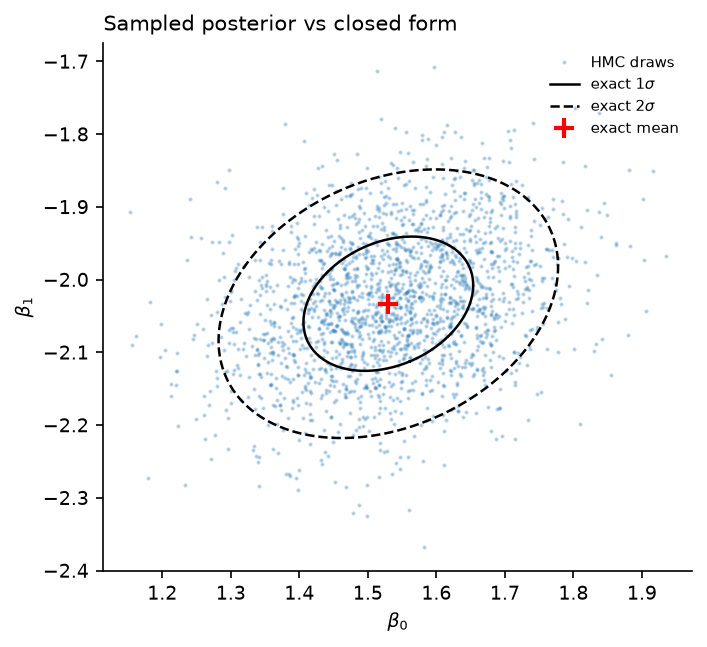</p>

<p align="center">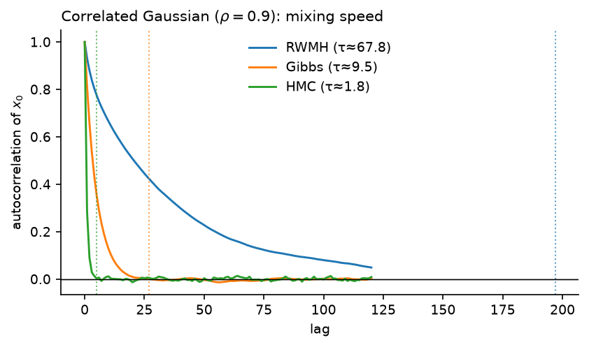</p>

### 2. Neal's funnel (`experiments/funnel.py`)

True $v$-marginal is $N(0, 3^2)$ exactly — so bias is measurable:

| sampler | draws | E$[v]$ (true 0) | sd$[v]$ (true 3) | $\tau(v)$ | ESS$(v)$ | $\hat R(v)$ | divergent |
|---|---|---|---|---|---|---|---|
| RWMH | 400k | 0.53 | 2.22 | 2361 | 169 | 1.04 | — |
| HMC (centered) | 100k | 0.49 | 2.60 | 190 | 528 | 1.02 | 5 998 |
| HMC (non-centered) | 100k | **0.02** | **2.99** | 12.5 | 8 001 | 1.000 | 0 |

Two honest lessons the numbers force on you: (1) $\hat R = 1.04$ while
missing the neck entirely — $\hat R \approx 1$ is *necessary, not
sufficient*; only the exact marginal exposes the bias. (2) The centered HMC
divergences aren't noise to suppress; they're the sampler reporting the
region it cannot enter. The non-centered change of variables
$x_i = e^{v/2} z_i$ makes the target an independent Gaussian (the Jacobian
cancels the varying scale exactly — derivation in Sec. 4.6), and every
pathology disappears.

<p align="center">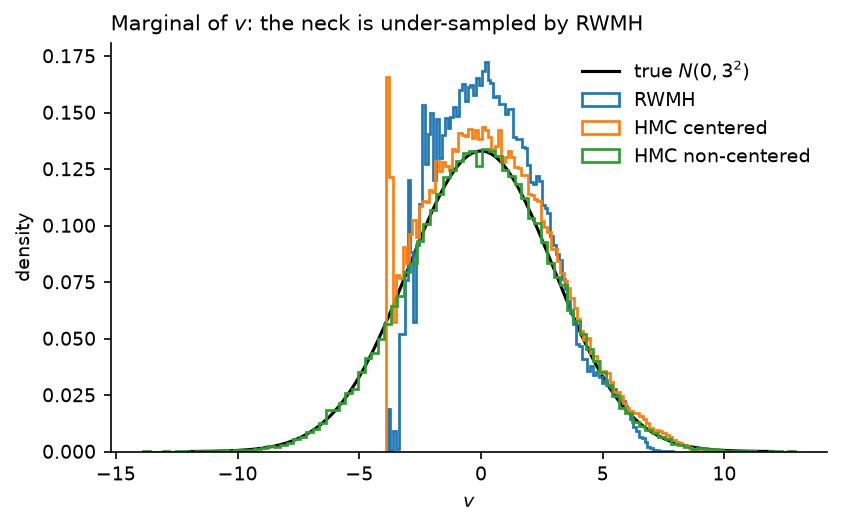</p>

### 3. Real data: eight schools (`experiments/eight_schools.py`)

Rubin's (1981) SAT coaching study under the hierarchical model
$y_j \sim N(\theta_j, \sigma_j^2)$, $\theta_j \sim N(\mu, \tau^2)$,
$p(\mu) \propto 1$, $\tau^2 \sim \text{InvGamma}(1, 1)$. No closed form
exists, so correctness rests on **two independent routes agreeing**:
conjugate Gibbs on the centered parameterization vs HMC on the non-centered
one (different parameterizations, different kernels, different code paths).

Result: all 10 posterior means agree to **0.131** (posterior sds are ~4.3,
so this is within Monte Carlo error), $\hat R \le 1.002$ everywhere. HMC's
ESS on $\mu$ is 63k from 80k draws vs Gibbs's 1.5k from 160k — the centered
Gibbs chain suffers exactly the $\mu$–$\theta$ coupling that non-centering
removes.

<p align="center">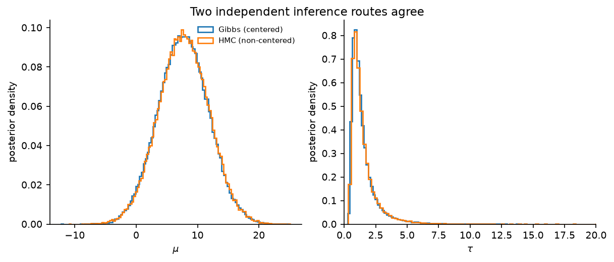</p>
<p align="center">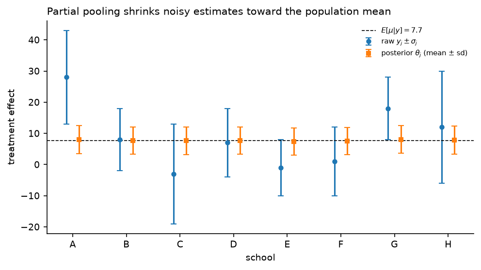</p>

**Prior sensitivity, stated plainly:** the InvGamma(1,1) prior on $\tau^2$
was chosen to keep all Gibbs conditionals conjugate, and it concentrates
$\tau$ near ~1.5, i.e. strong pooling. The classic half-Cauchy analysis
(Gelman 2006) is far more diffuse in $\tau$. With $J = 8$ noisy groups the
data genuinely cannot pin $\tau$ down, so the prior matters — both routes
share the prior, which is what makes their agreement a valid check of the
*samplers* rather than a claim about the *science*.

### 4. Multimodal targets: parallel tempering (`experiments/tempering.py`)

Every sampler above assumes it can reach the whole distribution. On a
well-separated mixture that assumption breaks: the barrier between modes is
crossed with exponentially small probability, so a single chain reports
whichever mode it started in. Two Gaussians 12 units apart (weights
0.35 / 0.65), **both samplers started entirely in the left mode**:

| sampler | E$[x_0]$ (true 1.8) | left-mode frac (true 0.35) |
|---|---|---|
| single random walk | −6.0 | 1.00 (never crossed) |
| parallel tempering (8 replicas) | **1.82** | **0.35** |

Parallel tempering runs replicas at inverse temperatures $\beta_k$ from 1 down
to 0.01; the hot replicas roam freely across the flattened landscape and
adjacent-replica swaps ferry that mobility down to the cold ($\beta=1$) chain.
Swap acceptance holds at ~0.7 across the ladder, so the mode-hopping actually
reaches the bottom.

<p align="center">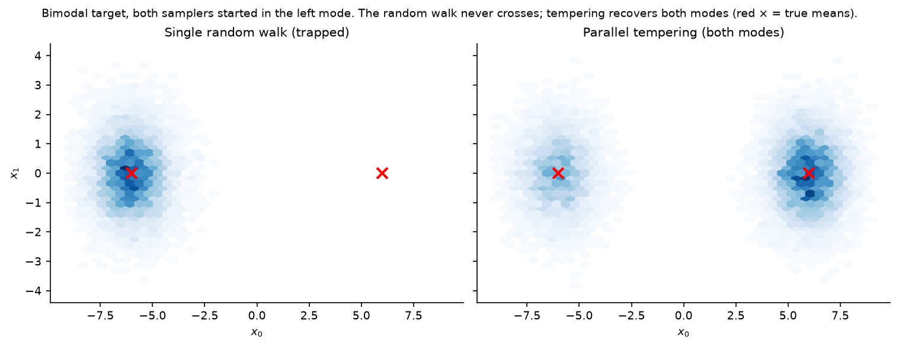</p>

### 5. A real posterior: Bayesian neural network (`experiments/bnn.py`)

Every target above is a hand-written density. This one is a *model*: the
unknown is the full weight vector of a small tanh MLP (`mcmc/bnn.py`,
$3H+1 = 49$ dimensions at $H=16$), and the target is its Bayesian posterior —
Gaussian likelihood, isotropic Gaussian prior. The log-posterior gradient is a
backprop pass written out by hand and checked against finite differences, so
HMC is running on exactly the quantity training would compute. The data is
$\sin(3x)$ on $[-2, 2]$ **with a gap cut out of the middle**; the question is
which method reports that it is guessing across the gap.

Three predictive bands on the same model — HMC (samples the posterior), a
5-member deep ensemble (the same net from 5 random inits), and a single Adam
MAP point estimate:

<p align="center">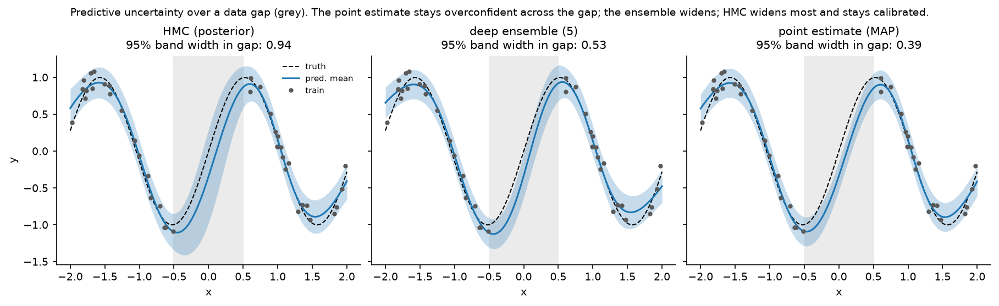</p>

Held-out calibration on 400 fresh points, split into the observed region and
the gap (95% target coverage):

| method | region | 95% coverage | mean NLL | mean pred. std |
|---|---|---|---|---|
| HMC (posterior) | observed | 0.94 | −0.67 | 0.11 |
| HMC (posterior) | **gap** | **1.00** | **0.08** | **0.24** |
| deep ensemble (5) | observed | 0.88 | −0.50 | 0.11 |
| deep ensemble (5) | **gap** | 0.57 | 0.84 | 0.14 |
| point estimate (MAP) | observed | 0.91 | −0.63 | 0.10 |
| point estimate (MAP) | **gap** | **0.30** | **2.47** | 0.10 |

The point estimate has no epistemic uncertainty — its band is a constant-width
noise ribbon, so it stays just as confident inside the gap (coverage collapses
to 0.30, NLL blows up to 2.47). The deep ensemble widens and is the strong
cheap baseline, but still under-covers the gap (0.57). HMC widens the most and
stays calibrated (1.00 / NLL 0.08).

**Does the section 7 metric help here? No — measured, three paired seeds.**
The obvious next knob on a 49-dimensional posterior is the diagonal mass
matrix: warmup estimates each coordinate's marginal variance and preconditions
it to unit scale. The adapted scales do span 7.4×, so there is anisotropy to
find. It buys nothing (median over three seeds, arms differing only in
`adapt_mass`):

| metric | step size | accept | median pred. ESS | ESS / 1k gradients | divergences |
|---|---|---|---|---|---|
| identity | 0.004 | 0.90 | 927 | 1.180 | 0 |
| adapted diagonal | 0.003 | 0.91 | 904 | 1.151 | 1 |

The step size does not go *up*, which is the tell: the curvature that limits it
was never a per-axis scale. This posterior is invariant to permuting hidden
units and to sign flips, so a coordinate's marginal variance is a spread across
symmetric modes rather than the width of the basin a chain is sitting in, and
rescaling by it does not line up with the local Hessian. A diagonal metric
rescales axes and cannot rotate them (§7 says so on a target where the axes
were the right ones); here they are not.

**Convergence is judged in function space, on purpose.** The weight posterior
is invariant to permuting hidden units and to sign-flipping (tanh is odd), so
it is massively multimodal and split-$\hat R$ on a raw weight coordinate is
meaningless — measured here, median 1.55 and up to 2.58 across coordinates.
The *predictions* are a permutation-invariant functional of the weights, and
their split-$\hat R$ sits at 1.02 (max 1.08) with ESS in the hundreds. Always
diagnose the quantity you care about, not the raw parameters.

### 6. External benchmark: ours vs emcee (`experiments/external_benchmark.py`)

Every section above validates against an *exact answer*. This one validates
against another *sampler*: [emcee](https://emcee.readthedocs.io) (Foreman-Mackey
et al. 2013), the widely used affine-invariant ensemble sampler. emcee is
gradient-free and its stretch move is invariant under affine reparameterization
— which is the entire benchmark. It is run **vectorized** on our batched
`logpdf` (same NumPy-over-an-ensemble computation as ours, so the wall-clock gap
is algorithmic), ESS is computed with *our* estimator for every sampler, and
"evaluations" counts every call touching the whole model over the full run —
a density eval (RWMH/emcee), a full-conditional draw (Gibbs), or a gradient eval
(HMC), with emcee's counted exactly by wrapping its log-prob.

**Correlated Gaussian** ($\rho = 0.9$), worst-dimension ESS:

| sampler | grad? | draws | min ESS | ESS / 1k evals | $\hat R$ |
|---|---|---|---|---|---|
| RWMH (ours) | no | 160k | 2 112 | 12.6 | 1.001 |
| Gibbs (ours) | no | 160k | 16 778 | **49.9** | 1.000 |
| HMC (ours) | yes | 40k | **20 608** | 24.6 | 1.000 |
| emcee (stretch) | no | 256k | 8 050 | 27.9 | 1.003 |

Per evaluation, emcee's affine-invariant stretch beats the naive
coordinate-wise random walk with **zero tuning** (27.9 vs 12.6 — the
correlation an affine map removes costs it nothing) and even edges HMC's
per-eval number. But recall an HMC evaluation is a *gradient*, the rest are
*densities* (a gradient costs a constant factor more — the honest asterisk on
the per-eval column). On a target this cheap and low-dimensional, exact-
conditional Gibbs wins outright — both per evaluation and, at ~38k ESS/s,
per wall-clock second. No single method leads on every axis.

**Eight schools** (10-dim), ESS on $\mu$ and the hard funnel-neck coordinate $\tau$:

| sampler | grad? | ESS($\mu$) | ESS($\tau$) | ESS($\tau$) / 1k evals | $\hat R(\tau)$ |
|---|---|---|---|---|---|
| Gibbs (ours, centered) | no | 601 | 6 690 | **7.6** | 1.001 |
| HMC (ours, non-centered) | yes | **30 274** | 5 872 | 6.4 | 1.001 |
| emcee (stretch, non-centered) | no | 6 845 | 6 035 | 6.9 | 1.004 |

HMC is the only sampler uniformly efficient across all ten coordinates —
gradient plus non-centering give ESS($\mu$) ~30k — but that took a hand-derived,
Jacobian-corrected gradient *and* the reparameterization, and it still logged
~1% divergences in the neck. **emcee's real case is here:** with no gradient and
no reparameterization, it reaches ESS comparable to HMC on the hard $\tau$
coordinate and balanced ESS elsewhere, for the price of writing down the
log-density alone. Centered Gibbs is fastest per second but its $\mu$–$\theta$
coupling wrecks ESS($\mu$) (~600) — the same coupling non-centering removes.

<p align="center">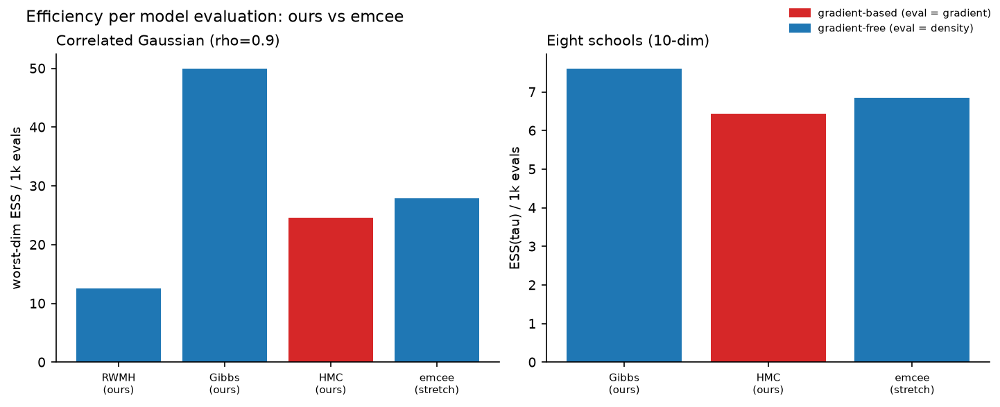</p>

The honest summary: **use the gradient when you have it and the dimension isn't
tiny** (HMC's uniform, high per-coordinate ESS), **use conjugacy when you have
it** (Gibbs's cheap exact conditionals), and **reach for a gradient-free
ensemble like emcee when deriving a gradient is impractical** — it is
genuinely competitive per evaluation and needs nothing but the log-density.

### 7. Diagonal mass-matrix adaptation (`experiments/mass_matrix.py`)

Every HMC run above used the identity metric — one step size for every
direction. On an axis-aligned target of unequal scales that single step size is
squeezed by the *tightest* direction (leapfrog's stability limit is set by the
largest curvature), so the *widest* direction is under-stepped and mixes slowly.
The fix is a mass matrix $M$ with $K(p) = \tfrac12 p^\top M^{-1} p$, adapted so
$M^{-1} = \operatorname{diag}(\text{marginal variances})$ — each coordinate is
preconditioned to unit scale and one step size fits all of them (drift becomes
`x += eps * inv_mass * p`; a diagonal rescale is still a shear, so exactness is
untouched — derivation and the whitening argument in [theory](theory/derivations.md) §4.8).
The diagonal is learned during warmup from Stan-style memoryless expanding
windows, with the step-size dual averaging restarted after each metric change.

**Anisotropy sweep**, diagonal Gaussian $N(0, \operatorname{diag}(1, r^2))$,
wide-coordinate ESS per 1000 gradients (mean of 5 seeds; the two metrics share
seeds, so the metric is the only difference):

| scale ratio $r$ | identity metric | adapted diagonal | recovered $M^{-1}_{22}$ (true $r^2$) |
|---|---|---|---|
| 2  | 26.9 | 30.2 | 3.9 (4) |
| 5  | **3.4** | 28.5 | 24.2 (25) |
| 10 | 34.0 | 28.0 | 96.6 (100) |
| 25 | 16.1 | 30.5 | 603 (625) |
| 50 | **3.3** | 28.3 | 2395 (2500) |

The adapted metric recovers the true variance and **whitens every $r$ to the
same isotropic problem** — a flat $\approx 30$ ESS/1k-grad regardless of scale.
The identity metric is at the mercy of the scale: its single step size resonates
unpredictably with the wide direction (fixed-$L$ HMC), swinging from 3 to 34 with
no reliability. The win is not a fixed multiplier — it is *scale-independence*.

<p align="center">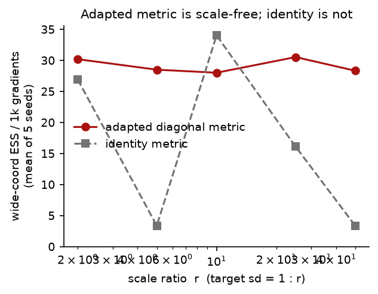</p>

**Eight schools** (non-centered), ESS per 1000 gradients by coordinate:

| coordinate | identity | adapted | gain |
|---|---|---|---|
| $\mu$ (wide) | 36.5 | 47.8 | 1.3× |
| $\log\tau$ (funnel) | 9.1 | 21.5 | 2.4× |
| $\eta_1$ | 3.2 | 47.8 | **14.8×** |

The metric widens $\mu$ and the $\eta_j$ — the coordinates the unit step size
under-served — driving them to near-independence ($\tau_{\text{int}}\to 1$, hence
the shared ceiling of 47.8). But $\log\tau$ gains only 2.4×: **a diagonal metric
rescales marginals, it cannot rotate**, so the funnel curvature in $(\log\tau,
\eta)$ survives. That residual is exactly what a dense metric or NUTS is for
(Days 17–18) — the honest limit of the cheap fix.

### 8. Rank-normalized split-$\hat R$ (`experiments/rank_rhat.py`)

Classic split-$\hat R$ (§6.2) is a ratio of a between-chain to a within-chain
*variance* — meaningful only when the target has one. On a heavy-tailed
posterior, $W$ is dominated by a few enormous draws and is so noisy that a real
between-chain disagreement disappears into it: the statistic reads a falsely
reassuring $\approx 1.00$ on chains that have plainly not mixed. Since heavy
tails are exactly where mixing is hardest, this is the case you most want a
diagnostic to catch. Vehtari et al. (2021) work with *ranks* instead — finite no
matter how heavy the tails: pool the draws, replace each by its (average) rank,
map ranks to normal scores via the Blom transform
$z = \Phi^{-1}\!\big((r-\tfrac38)/(mn-\tfrac14)\big)$, and run ordinary
split-$\hat R$ on those (`bulk`). A disagreement in *scale* (same centre,
different spread) slips past a location statistic, so the reported value also
folds to $|x-\text{median}|$ and repeats (`folded`); the rank-normalized
$\hat R$ is the max.

Three controlled cases, each with a known verdict (deterministic; `SEED = 20260719`):

| case | classic $\hat R$ | rank bulk | rank folded | rank $\hat R$ | binds |
|---|---|---|---|---|---|
| A — mixed $N(0,1)$ (converged) | 1.00 | 1.00 | 1.00 | **1.00** | — |
| B — Cauchy, location shift of 6 | 1.00 | **1.27** | 1.00 | **1.27** | bulk |
| C — Cauchy, scale $1$ vs $6$, same median | 1.00 | 1.00 | **1.18** | **1.18** | folded |

<p align="center">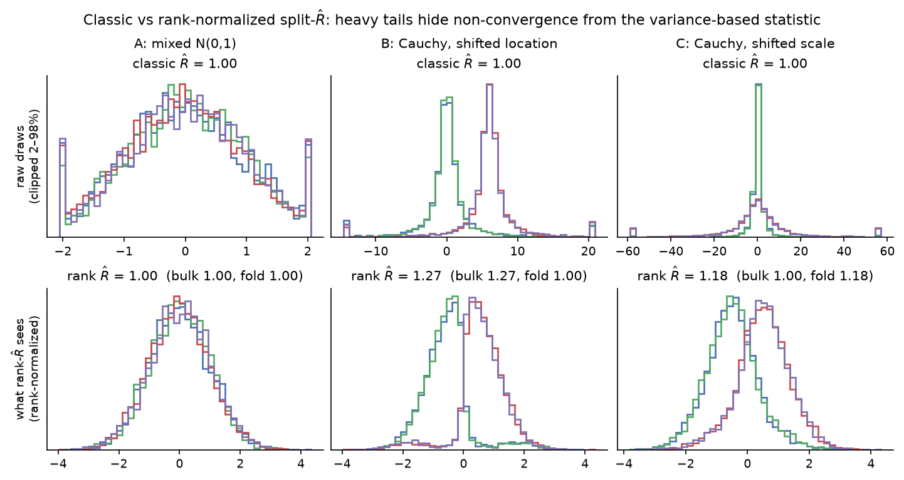</p>

Reading the three: (A) where the classic statistic is valid the rank version
agrees — it is not allowed to invent a problem. (B) two of four Cauchy chains
shifted by three inter-quartile ranges are genuinely unmixed, but the infinite
variance fools the classic statistic; the rank *bulk* term catches the shift.
(C) equal medians, unequal spread — now the *location* terms (classic **and**
rank-bulk) are both blind, and only the folded term sees it. C is the case that
justifies folding rather than stopping at the bulk rank statistic. `summarize()`
reports `rhat_rank` next to the classic `rhat` so the gap is visible per
coordinate.

### 9. Why NUTS: adaptive trajectory length per gradient (`experiments/nuts_benchmark.py`)

Dual averaging tunes the step size and the diagonal metric (§7) fixes one scale
mismatch, but fixed-length HMC still carries a hand-set knob: the number of
leapfrog steps $L$. Too few and the proposal barely moves; too many and the
trajectory U-turns back toward the start, so the extra gradients buy nothing.
NUTS ([`mcmc/nuts.py`](mcmc/nuts.py), multinomial form of Betancourt 2017) grows
each trajectory until it starts to fold back on itself — no $L$. The honest
question is whether removing the knob *costs* efficiency; the yardstick is **ESS
per gradient** (per 1000 model evaluations — the hardware-independent currency,
with the same asterisk as §6: a gradient eval does more work than RWMH's density
eval, so the per-eval column flatters the gradient-free row).

| non-centered funnel (10-dim) | grad | ESS($v$) | min ESS | **ESS($v$) / 1k ev** | mean depth |
|---|---|---|---|---|---|
| RWMH | density | 1,102 | 1,102 | 4.2 | — |
| HMC (fixed $L=20$) | gradient | 6,616 | 6,616 | 6.7 | — |
| **NUTS** | gradient | 4,545 | 4,545 | **29.2** | 1.9 |

| eight schools (10-dim) | grad | ESS($\tau$) | min ESS | **ESS($\tau$) / 1k ev** | div |
|---|---|---|---|---|---|
| RWMH | density | 5,366 | 181 | 20.6\* | 0 |
| HMC (fixed $L=20$) | gradient | 6,148 | 6,148 | 5.8 | 547 |
| **NUTS** | gradient | 10,779 | 1,963 | **33.6** | 172 |

<p align="center">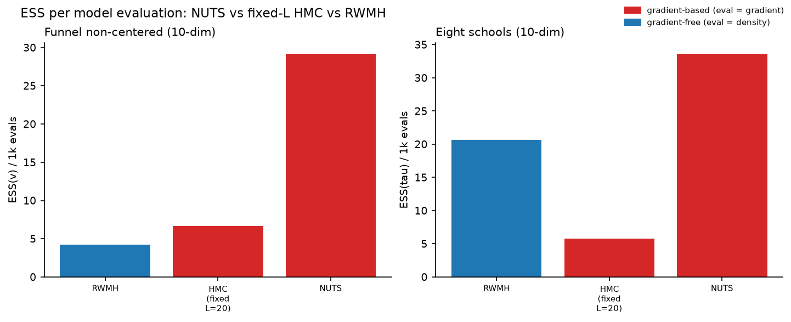</p>

On the benign non-centered funnel the win is purely length: a fixed $L=20$
overshoots the U-turn on the easy directions, while NUTS picks a mean depth of
~2 (≈ a handful of steps) and gets **~4× the ESS per gradient**. On eight
schools NUTS has the most ESS($\tau$) per gradient of the three; RWMH's 20.6\*
carries the asterisk (its eval is a cheap density, and its worst-coordinate ESS
is 181 against NUTS's 1,963).

**NUTS removes the length knob, not the geometry.** Run it on the *centered*
funnel and its divergences pile into the neck — 13% of iterations, and $v$ is
under-covered ($\mathrm{sd}\,2.7$ vs the true $3.0$). Non-centering (§2) drops
that to **zero** divergences and $\mathrm{sd}\,3.0$. This is the honest limit and
the note on simplifications vs Stan: our NUTS uses only a *diagonal* metric and
the endpoint-momentum U-turn check, so the neck's curvature defeats it exactly as
it defeats fixed-L HMC — but the centered funnel defeats Stan's NUTS too, because
the neck is a property of the parameterization, not the sampler. The fix is
choosing good coordinates, not a fancier integrator.

<p align="center">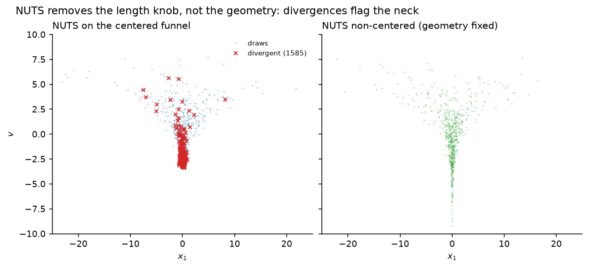</p>

### 10. The normalizing constant, and what it costs (`experiments/ais.py`)

Every sampler above works on an unnormalized density because $Z$ cancels out of
the accept ratio — which is also why none of them can report a marginal
likelihood or a Bayes factor. `mcmc/ais.py` is the one thing here that can.
Ground truth is free: each target is a normalized density times $e^{2.5}$, so
$\log Z = 2.5$ exactly, in every dimension.

**At a fixed budget, annealing is not automatically worth it.** Cost is
$T \times k \times N$ target evaluations, so a longer ladder means fewer
particles. Sweeping $T$ with the budget held at 40,000, over 40 replicates:

| | $T=1$ (plain IS) | $T=10$ | $T=100$ | $T=500$ | best |
|---|---|---|---|---|---|
| $d = 4$, RMSE of $\log Z$ | **0.072** | 0.142 | 0.186 | 0.160 | $T = 1$ |
| $d = 8$, RMSE of $\log Z$ | 1.091 | 2.154 | 0.926 | **0.595** | $T = 500$ |

At $d = 4$ plain importance sampling wins by 2.6×, and it is not an untuned
comparison: eight settings of ladder length, step size, and transitions per
rung were tried, and the best annealed one is 0.186. At $d = 8$ the ordering
reverses and annealing is worth 1.8×.

The column that reconciles them is the effective particle count, not the ESS
*fraction* the diagnostic reports. At $d = 4$, $T = 1$ has an ESS fraction of
0.005 — which sounds catastrophic — but 0.005 of 40,000 particles is **182**
effective ones, while $T = 500$ turns a fraction of 0.352 into **28**. A ladder
buys ESS fraction by spending the particles it is a fraction of, and only wins
when the fraction was so small that there was nothing left to spend: at
$d = 8$, $T = 1$ is down to **4.0** effective particles out of 40,000.

**Unbiased in $Z$, biased low in $\log Z$, and the size is not small.** With a
deliberately mismatched proposal at $d = 4$ and $T = 1$ (120 replicates per
row), the estimate of $\log Z$ sits *below* the truth by

| $N$ | 50 | 100 | 200 | 400 | 800 | 1600 |
|---|---|---|---|---|---|---|
| bias (nats) | −6.06 | −3.74 | −2.12 | −1.24 | −0.67 | −0.31 |
| after jackknife | −1.81 | −1.11 | −0.37 | −0.38 | −0.19 | −0.01 |

Jensen fixes the sign, so an under-resourced run *understates* the evidence
rather than scattering around it — the failure that quietly decides a Bayes
factor. The jackknife removes most of it (a factor of 3–20 here) and not all.
And the decay is slower than the $O(1/N)$ leading term predicts over this
range: $N \times \text{bias}$ drifts from −303 to −493 instead of settling, so
the higher-order terms are still doing real work at $N = 1600$.

**Where it lies to you — not where I expected.** Two Gaussians 12 apart, the
target §4 built parallel tempering for, and no transition here ever crosses the
barrier. AIS gets it right anyway (error −0.04): its independence comes from
drawing $p_0$ afresh every particle, not from the chain mixing, so a $p_0$ that
straddles both modes fixes the weights without anything ever crossing. The
genuine failure needs a $p_0$ that never proposes into a mode:

| $p_0$ | $\log Z$ | error | predicted | ESS fraction |
|---|---|---|---|---|
| broad, covers both | 2.460 | −0.040 | — | 0.506 |
| narrow on left mode | 1.450 | **−1.050** | $\log 0.35 = -1.050$ | **1.000** |
| narrow on right mode | 2.069 | **−0.431** | $\log 0.65 = -0.431$ | **1.000** |

Both failures are exact rather than noisy — the estimate is short by precisely
the log of the mass it never saw — and both report a *perfect* effective sample
size, because the weights within the one mode it can see are uniform. The only
diagnostic available without ground truth is at its most reassuring exactly
when the answer is wrong.

<p align="center">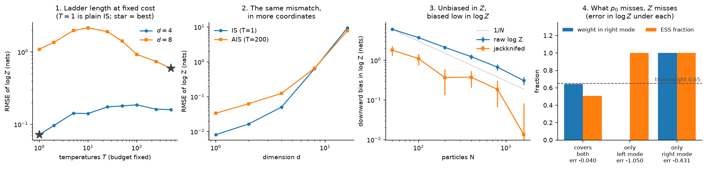</p>

### 11. Momentum without an accept step: SGHMC and its friction (`experiments/sghmc.py`)

[`mcmc/sgld.py`](mcmc/sgld.py) deletes MALA's accept step and pays an
$O(\epsilon)$ bias for it, measured there against a closed form. The same
deletion applied to *HMC* does not merely cost a bias — the chain has **no
stationary distribution at all**. Leapfrog is volume preserving, which is
exactly why HMC's single accept can repair a whole trajectory; feed it a noisy
gradient and every step pumps energy in with nothing to take it out. Chen, Fox
& Guestrin (2014) add friction, and this section measures whether that repair
works, what it costs, and whether it is affordable on a real posterior.

Because the gradient is linear on a Gaussian, the update is a 2-D Gaussian
AR(1) in $(\theta, v)$ and the stationary covariance is the exact solution of a
discrete Lyapunov equation — closed form, no Monte Carlo. Everything below is
scored against that, and the tests score it in turn against the same solution
worked out by hand, which shares no code with the solver.

**The two errors separate by their order in the step, and only one of them is
the discretization.** Writing $S = \mathrm{Var}[\theta]$, $P = \mathrm{Var}[v]$
and $\Delta V = V - \hat V$ for the gradient-noise variance the sampler fails to
correct for:

$$\mathrm{Cov}[\theta, v] = \tfrac{h}{2} P, \qquad
S = s^2 + \tfrac{h^2}{4} P + \frac{s^2 h \,\Delta V}{2\gamma}.$$

So an uncorrected minibatch noise is an $O(h)$ error divided by the friction,
against an $O(h^2)$ discretization error. Shrinking the step barely helps: over
four halvings the discretization term falls 4× each time and the miscorrection
term only 2×, and by $h = 0.0125$ the second is **300× the first**. Raising
$\gamma$ *does* help, exactly 2× per doubling. The position–momentum correlation
is nonzero at every step and every friction, which the target says should be
zero — an artifact of updating $\theta$ with the new velocity, not of the noise.

**Sampler against closed form, 23 cells, three arms** ($\gamma = 1$, $V = 4$,
512 chains × 8000 draws). The table is the *closed form* for
$\mathrm{Var}[\theta]$; every sampled cell lands within **0.17%** of its own
prediction — not within 0.17% of the target, which is a different and much
weaker claim:

| $h$ | 0.05 | 0.1 | 0.2 | 0.3 | 0.4 | 0.5 | 0.6 |
|---|---|---|---|---|---|---|---|
| exact gradient | 1.0006 | 1.0026 | 1.0112 | 1.0272 | 1.0526 | 1.0909 | 1.1475 |
| noisy, uncorrected | 1.1007 | **1.2032** | 1.4157 | 1.6435 | 1.8947 | 2.1818 | 2.5246 |
| noisy, corrected | 1.0006 | 1.0026 | 1.0112 | 1.0272 | 1.0526 | 1.0909 | *refused* |

The corrected row is the exact-gradient row *identically*: the correction is
algebraic, not approximate, so subtracting $h^2\hat V$ from the injected
variance restores the noise-free stationary law digit for digit. And the last
cell is the constraint showing itself — $2\gamma \geq h \hat V$ caps the step at
$2\gamma/\hat V = 0.5$, so the run is refused rather than quietly re-tuned.

**Without friction it does not converge to anything.** At $\gamma = 0$ the
transition matrix has determinant 1, its eigenvalues sit on the unit circle, and
the variance grows roughly linearly in the number of steps — 1.29, 2.58, 4.78,
9.84, 20.36 against a target variance of 1, at 1k through 16k steps. The closed
form raises there instead of returning a number.

**Momentum is worth 2–9× at matched cost, and the friction decides which.**
Both samplers spend exactly one gradient per step, so equal cost is equal steps;
what has to be equalized is the *bias*, and both have a closed form for it, so
each step size is solved (not tuned) to put the stationary variance 1% above the
truth. Effective samples per gradient, 64 chains × 20,000 draws:

| | SGLD | SGHMC $\gamma{=}0.25$ | $\gamma{=}0.5$ | $\gamma{=}1$ | $\gamma{=}2$ | $\gamma{=}4$ |
|---|---|---|---|---|---|---|
| step | 0.1990 | 0.1965 | 0.1941 | 0.1894 | 0.1802 | 0.1633 |
| ESS / gradient | 0.0083 | **0.0763** | 0.0709 | 0.0611 | 0.0370 | 0.0169 |
| vs SGLD | 1.0× | **9.2×** | 8.5× | 7.4× | 4.5× | 2.0× |

The measured variances (1.0002 to 1.0155) all agree with the targeted 1.0100
within their own Monte Carlo error, which is reported beside them. The trend is
the mechanism: less friction means the momentum is forgotten more slowly and the
chain moves ballistically rather than diffusively, and $\gamma = 4$ is nearly
back to Langevin.

**The catch, on a real posterior.** The correction needs $\hat V$, and two
conditions have to hold at once: $2\gamma \geq h \hat V$ for the correction to
be defined, and $h\gamma < 2$ or the momentum recursion amplifies on its own.
Eliminating $\gamma$ leaves a bound involving no property of the target at all,
$h < 2/\sqrt{\hat V}$. On this repo's BNN posterior (200 points, 49 weights),
with $\hat V$ the worst per-coordinate minibatch-gradient variance:

| measured at | batch | worst $\hat V$ | max $h$ at $\gamma = 1$ | max $h$ at any $\gamma$ |
|---|---|---|---|---|
| prior draw | 10 | $2.1\times10^{7}$ | $9.4\times10^{-8}$ | $4.3\times10^{-4}$ |
| prior draw | 50 | $2.9\times10^{6}$ | $6.8\times10^{-7}$ | $1.2\times10^{-3}$ |
| MAP fit | 10 | $5.0\times10^{5}$ | $4.0\times10^{-6}$ | $2.8\times10^{-3}$ |
| MAP fit | 50 | $9.1\times10^{4}$ | $2.2\times10^{-5}$ | $6.6\times10^{-3}$ |

Measured at two points because the noise is local: a badly-fit draw has large
residuals, and the MAP fit is 43× quieter. It does not change the conclusion.
**The correction that makes SGHMC correct is not affordable here** — buying it
at a usable step needs a friction so large that the discretization it is
supposed to fix becomes unstable — which is the same shape as SGLD's own
finding on this posterior (see the `mcmc/sgld.py` row above): the regime where
the minibatch noise is negligible starts below a step anyone would run.

<p align="center">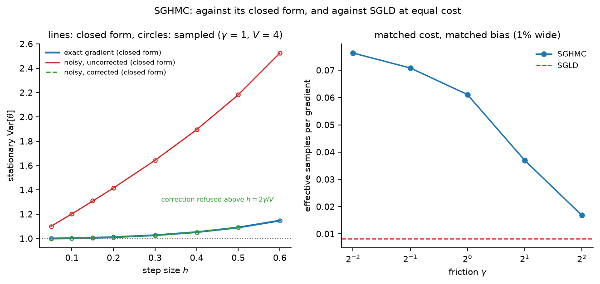</p>

What is **not** measured here, and would be the next real step: the sampling
bias of either unadjusted sampler against exact HMC *in function space* on that
BNN posterior. The weight posterior is invariant to permuting hidden units and
to sign flips, so a weight-space comparison is meaningless (§5 shows split-$\hat
R$ screaming on a raw coordinate), and doing it honestly means comparing
predictive bands, not parameters.

### 12. Heavy tails: three failures, and the diagnostic that sees one (`experiments/heavy_tails.py`)

[`mcmc/targets.py`](mcmc/targets.py) has shipped a Student-t since the first
commit, described there as "the standard heavy-tail mixing cautionary target",
and until now no result used it. The reason to run it is that "MCMC mixes badly
in heavy tails" runs three separate things together — and this target has an
exact sampler, so they come apart. An i.i.d. arm is a sampler with no
autocorrelation at all: anything that goes wrong *there* is not the sampler's
fault.

Three arms (exact draws, RWM, HMC) on a 1-D Student-t at six degrees of
freedom, and two estimands picked so that one has a central limit theorem at
every dof and the other does not: **the mean**, whose CLT needs a finite
variance ($\nu > 2$), and $P(|X| \le 1)$, bounded, whose CLT always holds and
whose exact value comes from quadrature
([`mcmc/tails.py`](mcmc/tails.py), checked against the $t_1$ and $t_3$
antiderivatives to 1e-12).

**1. The first failure is the estimand's, and no sampler can fix it.** The tail
index of a Student-t is $\nu$, so for $1 < \nu < 2$ the sample mean still
converges but at the generalized-CLT rate $n^{1/\nu - 1}$, and at $\nu = 1$ the
mean of $n$ Cauchy draws is distributed exactly like one draw. Fitted exponents
on **exact** draws, against the closed form:

| $\nu$ | mean, measured | predicted | $P(\lvert X\rvert\le1)$, measured | sample sd, measured | predicted |
|---|---|---|---|---|---|
| 1.0 | −0.014 | 0.000 | −0.535 | +0.463 | +0.500 |
| 1.25 | −0.213 | −0.200 | −0.523 | +0.305 | +0.300 |
| 1.5 | −0.335 | −0.333 | −0.487 | +0.184 | +0.167 |
| 2.5 | −0.493 | −0.500 | −0.525 | +0.024 | 0.000 |
| 5.0 | −0.512 | −0.500 | −0.488 | +0.003 | 0.000 |
| 30 | −0.499 | −0.500 | −0.512 | −0.000 | 0.000 |

The bounded functional holds $n^{-1/2}$ at every $\nu$ including the Cauchy, so
this is a fact about *which* quantity is being estimated and not about the
tails as such. Note also what the error had to be summarized by: the **median**
absolute error across replicates, because for $\nu \le 2$ the rms error is
itself infinite. The obvious summary of the error does not exist either.

**2. The second failure is not the one the folklore predicts, and measuring it
killed this section's intended headline.** The expectation going in was that
`mean ± 1.96 s/√n` would badly under-cover where the variance it estimates does
not exist. It does not. Coverage is at or above nominal at *every* dof, the
Cauchy included:

| $\nu$ | coverage, n=250 | width | coverage, n=16,000 | width | width ratio |
|---|---|---|---|---|---|
| 1.0 | 0.977 | 2.374 | 0.980 | 2.326 | **1.02×** |
| 1.25 | 0.976 | 0.935 | 0.968 | 0.392 | 2.39× |
| 1.5 | 0.969 | 0.530 | 0.969 | 0.141 | 3.76× |
| 2.5 | 0.953 | 0.232 | 0.951 | 0.032 | 7.25× |
| 5.0 | 0.952 | 0.159 | 0.949 | 0.020 | 7.95× |
| 30 | 0.947 | 0.128 | 0.951 | 0.016 | 8.00× |

The statistic is **self-normalized** — $s$ is inflated by exactly the draws that
inflate the numerator — and for symmetric heavy tails that ratio stays tight.
The algebra says the same thing and is the more useful form: $s$ grows like
$n^{1/\nu - 1/2}$, so the half-width $s/\sqrt n$ shrinks like $n^{1/\nu - 1}$,
which is the mean's *true* error rate from the table above. The interval is
rate-matched for free. What it loses is not honesty but information: at
$\nu = 1$, **64× the data buys a 2% narrower interval**, against the 8.00× a
light-tailed target delivers at the same budget. The trouble is legible in the
width's scaling with $n$, never in the coverage — and only if you vary $n$ at
all, which one run does not.

**3. The third failure is the sampler's, it is real, and it is the only one ESS
sees.** At $n = 4{,}000 \times 256$ chains:

| $\nu$ | ESS/draw: iid | RWM | HMC | max $\lvert x\rvert$: iid | RWM | HMC |
|---|---|---|---|---|---|---|
| 1.0 | 1.000 | 0.002 | 0.002 | 536,365 | 228 | 496 |
| 1.5 | 1.000 | 0.005 | 0.002 | 10,392 | 199 | 335 |
| 5.0 | 0.998 | 0.171 | 0.463 | 39 | 17 | 39 |
| 30 | 1.000 | 0.222 | 0.363 | 8 | 6 | 6 |

A bulk-scaled proposal under-visits the tails, and the cost is steep: HMC's ESS
per draw falls **180×** between $\nu = 30$ and the Cauchy, and the farthest
excursion any chain makes falls three orders of magnitude short of where exact
draws reach. That is exactly what ESS was built to detect, and it detects it.

**The point of running all three together is what ESS does on the first
failure: nothing.** The i.i.d. arm reads ESS/draw = 1.000 at every dof — it must,
there is no autocorrelation — while its sample mean at $\nu = 1.5$ is converging
at $n^{-1/3}$ and at $\nu = 1$ is not converging at all. ESS measures
autocorrelation, which is one of the three things that can go wrong here, and a
perfect ESS is consistent with an estimator that will never reach its target.
The diagnostic that would have caught it is the one nobody plots: the interval
width against $n$.

Two smaller things worth keeping. The samplers are **slow, not wrong** — their
error on the bounded functional is ≤ 0.004 at every dof, so inefficiency is the
whole of the damage. And substituting ESS for $n$ in the interval makes it
*conservative* rather than optimistic (coverage 0.996–1.000 in the low-dof MCMC
cells), because a collapsed ESS widens the interval; the coverage column in that
table is over 256 replicates and carries about ±0.014, so the converged coverage
numbers are the i.i.d. ones above.

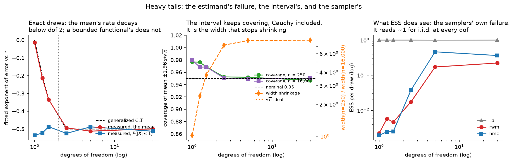

### Appendix: batched chains scale almost for free

Every sampler advances all its chains in lockstep as one batched NumPy
computation (`mcmc/base.py`), so the extra chains are close to free until they
saturate memory bandwidth. Timing HMC on a 10-D correlated Gaussian (fixed step
size and leapfrog length, so the per-chain arithmetic is identical) across
`n_chains` from 1 to 64 makes that concrete:

| `n_chains` | ms / iteration | ms / iter / chain | effective samples / s |
|---|---|---|---|
| 1 | 0.12 | 0.119 | 3.2k |
| 8 | 0.12 | 0.015 | 29k |
| 64 | 0.22 | 0.003 | 112k |

Going from 1 to 64 chains costs only ~1.8× the wall-clock *per iteration* — so
the per-chain cost falls ~36× and effective-sample **throughput** rises almost
linearly with the chain count (the right panel tracks the ideal line until
bandwidth starts to bind past ~16 chains). This is why the many-chain $\hat R$
diagnostics elsewhere in this repo are cheap to run. Numbers are machine-
dependent (`experiments/vectorized_scaling.py`); the statistical validity of the
batching at any chain count is pinned in `tests/test_vectorized_scaling.py`.

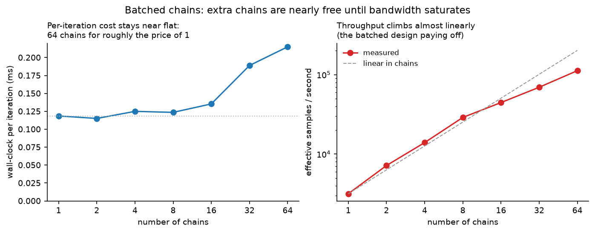

### Appendix: from MALA to score-based generative models

`mcmc/mala.py` is one Euler step along $\nabla\log\pi$ plus Gaussian noise,
with the asymmetric Hastings correction that makes it exact. Delete the accept
step and the same update is the *unadjusted* Langevin algorithm, and the
deletion is not free: on $\pi = N(0,1)$ the chain becomes AR(1) with stationary
variance $1/(1-\varepsilon^2/4)$, over-dispersed by 6.7% at $\varepsilon = 0.5$
and 19% at $0.8$ — a bias that more samples do not remove, only a smaller step
does. That is Exercise 1(c) in [`theory/derivations.md`](theory/derivations.md)
Sec. 7, and `tests/test_mala.py` measures both chains against it.

Score-based generative models run exactly that biased sampler, and not for
speed. They have a *learned* $\nabla\log\pi$ and no normalized density, so
there is nothing to put in a Metropolis ratio: the accept step is unavailable
in principle, not skipped. Two changes make it work anyway. First the target is
softened — sample a sequence of noised densities $\pi * N(0,\sigma_i^2 I)$ from
large $\sigma$ down to small, carrying the state forward, so the multimodality
that traps a single Langevin chain (the failure `experiments/tempering.py`
attacks here with replica exchange instead) is solved at the scale where the
modes have been smeared together. Second the step size is tied to the level,
$\varepsilon_i^2 \propto \sigma_i^2$, and it has a ceiling that holds for *any*
target: writing the noised score as a posterior mean gives
$\nabla s_\sigma \succeq -I/\sigma^2$, so the linearized update contracts only
while $\varepsilon^2 < 4\sigma^2$ — the same $4$ as in the variance formula
above.

Nothing there is a better MCMC method. It is a worse one, run on a target
nobody can write down, under an annealing schedule that buys back the mixing
the accept step was not there to fix. A companion repo,
[diffusion-from-scratch](https://github.com/porth-bot/diffusion-from-scratch),
builds that side of the bridge on 2D targets whose scores are known in closed
form — which is what makes the price of the missing accept step measurable
rather than argued: run its samplers on the exact score and on a learned one
and the difference is the estimation error, on its own. Two findings there
are about this paragraph. The step-size ceiling above is enforced in code,
because an unstable ladder does not blow up visibly — it returns samples with
the right support and the wrong mode weights. And running the annealed
Langevin sampler *longer* with a learned score makes it **worse** (sliced
$W_2$ 0.274 → 0.807 at ten times the budget), because an equilibrium sampler
converges to the stationary law of the score it was handed; the same sampler
with the exact score does not degrade. The accept step is what would have
caught that, and it is the thing that is not available.

## Reproduce

One command, from a clean clone:

```bash
python -m venv .venv && source .venv/bin/activate
pip install -r requirements.txt && pip install -e .
./reproduce.sh                  # tests, then all 16 experiments: ~6 min total
```

`requirements.txt` pins the exact versions every committed figure and table was
produced with (Python 3.12.13); `pyproject.toml` keeps lower bounds instead, so
CI goes on testing against current releases on 3.9 and 3.12.

**How exact is it?** Rerunning the whole suite in that pinned environment
regenerates 22 of the 23 committed PNGs byte-for-byte — the samplers are seeded
and NumPy's bit generators are stable across versions, so the chains, and
therefore the ESS and R-hat tables, are identical. The one file that differs is
`vectorized_scaling.png`, which plots wall-clock per step and so measures the
machine; the ESS-per-gradient columns next to it are the portable ones. Timing
numbers in this README are from a 2020s laptop CPU.

To run a single experiment instead:

```bash
cd experiments
python validate_exact.py        # ~8 s
python optimal_scaling.py       # ~6 s   (acceptance rate vs efficiency: the 0.234 rule)
python thinning.py              # ~3 s   (what thinning costs)
python gibbs_scan.py            # ~2 s   (systematic vs random scan)
python funnel.py                # ~12 s
python eight_schools.py         # ~6 s
python tempering.py             # ~2 s   (bimodal: tempering vs a trapped chain)
python bnn.py                   # ~110 s (Bayesian NN: HMC vs ensemble vs MAP, + the metric study)
python external_benchmark.py    # ~10 s  (ours vs emcee; needs `pip install emcee`)
python mass_matrix.py           # ~35 s  (diagonal metric: scale-free efficiency)
python rank_rhat.py             # ~1 s   (rank-normalized R-hat: heavy-tail robustness)
python nuts_benchmark.py        # ~35 s  (NUTS vs fixed-L HMC vs RWMH: ESS per gradient)
python vectorized_scaling.py    # ~3 s   (wall-clock per step vs chain count)
python ais.py                   # ~40 s  (annealed importance sampling: log Z against exact)
python sghmc.py                 # ~11 s  (SGHMC vs its closed form, and vs SGLD at equal cost)
python heavy_tails.py           # ~17 s  (Student-t: what breaks, and what ESS misses)
```

(Those are measured, not estimated: the timings come from the `reproduce.sh`
run above, which prints a per-step number.)

`emcee` is used *only* by the external benchmark — it is not a dependency of the
package or the tests (CI installs numpy + pytest only). Install it with
`pip install emcee` or `pip install -e '.[bench]'`.

Figures land in `figures/`; every table above is printed by the scripts.
Seeds are fixed (`SEED = 20260703`). There is nothing to download and no cached
state to warm up: the "log" this repo replays from is the seed plus the code.

## Design notes

- **Tests assert theory, not just plumbing.** Leapfrog reversibility at
  $10^{-10}$; $O(\varepsilon^2)$ energy scaling; Gibbs's lag-1
  autocorrelation equal to $\rho^2$ on a bivariate Gaussian; the ESS
  estimator recovering $\tau = (1+\rho)/(1-\rho)$ on AR(1) data; every
  hand-derived gradient against central differences.
- **Divergences are a feature.** Trajectories that leave the typical set
  overflow to `inf`/`NaN`, which propagates to a $-\infty$ acceptance ratio
  and a rejection — the mechanism *is* the diagnostic. `np.errstate` is
  scoped to exactly those computations, and the test suite turns any other
  `RuntimeWarning` into a failure.
- **Adaptation stops at warmup's end.** Tuning $\varepsilon$ from chain
  history during sampling would break invariance; dual averaging freezes at
  the averaged iterate.
- **Samplers never see closed forms.** Models expose only
  $\log\tilde\pi$ / $\nabla\log\tilde\pi$; exact posteriors live in separate
  methods used purely for validation.

## Limitations / next

- Trajectory length is now adaptive (NUTS, done, §9): the U-turn criterion
  removes the fixed-$L$ knob and buys ~4–6× the ESS per gradient. The remaining
  metric is still *diagonal* (§7) — it rescales marginals but cannot rotate, so a
  correlated funnel's curvature survives. Both our NUTS and Stan's diverge in the
  *centered* funnel neck; the fix there is non-centering, not the sampler. A
  *dense* or Riemannian metric is the principled next step for curvature the
  reparameterization cannot remove.
- **Phase 2 (done):** Bayesian neural network posterior via this repo's HMC on
  a small MLP — predictive uncertainty and calibration vs a MAP point estimate
  and a deep ensemble ([`experiments/bnn.py`](experiments/bnn.py), section 5).
  The diagonal mass matrix that used to sit here as the next step on this
  thread has been run and does not help (§5): the step size stays where it was,
  because on a posterior with permutation and sign symmetries a marginal
  variance is not the local scale. What would need testing next is a metric
  estimated from *curvature* rather than from marginal spread, on a
  symmetry-broken parameterization.
- **Heavy tails (§12, done as far as diagnosis goes):** what is *not* fixed
  there is any of it. The section measures that a bulk-scaled proposal loses
  180× its ESS per draw between $\nu = 30$ and a Cauchy, and stops. The
  standard repairs — a heavier-tailed proposal, a transformation of the target
  to light tails, or tempering the tail index — are none of them run here, and
  the honest reason is that the section's more useful half is the failure no
  sampler can repair (an estimand whose CLT does not exist), which a better
  proposal would leave exactly where it is.

## References

Key sources: Neal (2011) *MCMC using Hamiltonian dynamics*; Hoffman & Gelman
(2014) JMLR (dual averaging); Geyer (1992) *Statist. Sci.* (initial sequence
estimators); Gelman & Rubin (1992); Roberts, Gelman & Gilks (1997) (0.234);
Neal (2003) (funnel); Rubin (1981) (data); Betancourt (2017) arXiv:1701.02434;
Vehtari, Gelman, Simpson, Carpenter & Bürkner (2021) *Bayesian Anal.* 16
(rank-normalized $\hat R$, folding, tail-ESS); Blom (1958) (rankit transform);
Foreman-Mackey et al. (2013) PASP (emcee, the external-benchmark baseline).
Full list with roles in [`theory/derivations.md`](theory/derivations.md).

## Part of a from-scratch series

Same bar in each: the core written out by hand, every non-obvious claim checked
against a closed form or an independent oracle, limitations stated rather than
buried.

| Repo | Built from scratch |
| --- | --- |
| **mcmc-from-scratch** *(this repo)* | Metropolis-Hastings, Gibbs, HMC, NUTS, MALA, parallel tempering — validated against exact posteriors |
| [gp-from-scratch](https://github.com/porth-bot/gp-from-scratch) | GP regression, kernels with hand-derived gradients, ML-II, and the NTK/NNGP wide-network correspondence |
| [grokking-transformer](https://github.com/porth-bot/grokking-transformer) | A transformer that groks modular arithmetic, and the Fourier circuit it learns |
| [pinn-from-scratch](https://github.com/porth-bot/pinn-from-scratch) | Physics-informed networks: exact autograd PDE residuals against closed-form solutions |
| [diffusion-from-scratch](https://github.com/porth-bot/diffusion-from-scratch) | Score matching, reverse-time samplers, and the probability-flow ODE — against exact scores at every noise level |

The tie to gp-from-scratch is concrete, not decorative. Its NTK section shows
that an *infinite*-width network's posterior is a Gaussian process with a
closed-form mean and variance; section 5 here samples a *finite*-width
network's weight posterior with HMC precisely because that closed form is gone
— the same Bayesian question, on the two sides of the width limit. And the
MALA sampler above is the bridge in the other direction: unadjusted annealed
Langevin is that proposal minus the accept step, which is where score-based
generative models start.

## Provenance

Built as a study resource, with every derivation written out in
[`theory/derivations.md`](theory/derivations.md) and every non-obvious claim
tested. MIT license.

*Suggested GitHub topics:* `mcmc` `hamiltonian-monte-carlo` `gibbs-sampling`
`metropolis-hastings` `bayesian-inference` `numpy` `from-scratch`
